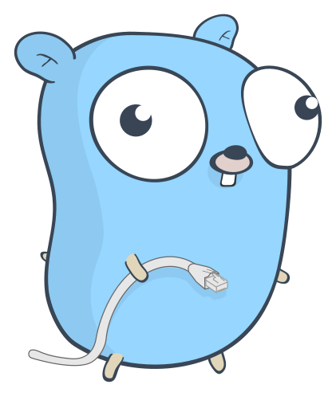

<div align="center">

</div>

# okconf

okconf is a simple, unambitious config library that gets out of the way. It was created as an alternative to contrast libraries such as [spf13/viper](https://github.com/spf13/viper), which &mdash; while extremely potent &mdash; require a fair amount of ceremony in order to get going.

okconf takes a more minimalist approach. Define your configuration as a `struct`, implement a `Default()` for it, and okconf will handle loading from and saving to JSON or YAML.

## Install

Add okconf to your project:

```shell
$ go get github.com/aevitas/okconf
```

## Usage

First, define your configuration as a `struct`:

```golang
type ExampleConfig struct {
	Name      string
	StartedAt time.Time
	Nested    NestedConfig
}

type NestedConfig struct {
	Count int
}
```

The only mechanism okconf relies on is a `Default` method it can use to establish a starting point for your configuration:

```golang
func (e ExampleConfig) Default() Config {
	return ExampleConfig{
		Name:      "Foo",
		StartedAt: time.Now().UTC(),
		Nested: NestedConfig{
			Count: 100,
		},
	}
}
```

Then, simply `Load` your config from your preferred source. For instance, to load from a JSON file:

```golang
cfg, err := okconf.LoadJSON[ExampleConfig]("/path/to/file")
```

The `cfg` variable now holds an `ExampleConfig` value with the values in the JSON file applied to the default config.

### Saving

okconf provides various methods to save your config, e.g.:

```golang
okconf.SaveJSON(cfg, "file.json")
```